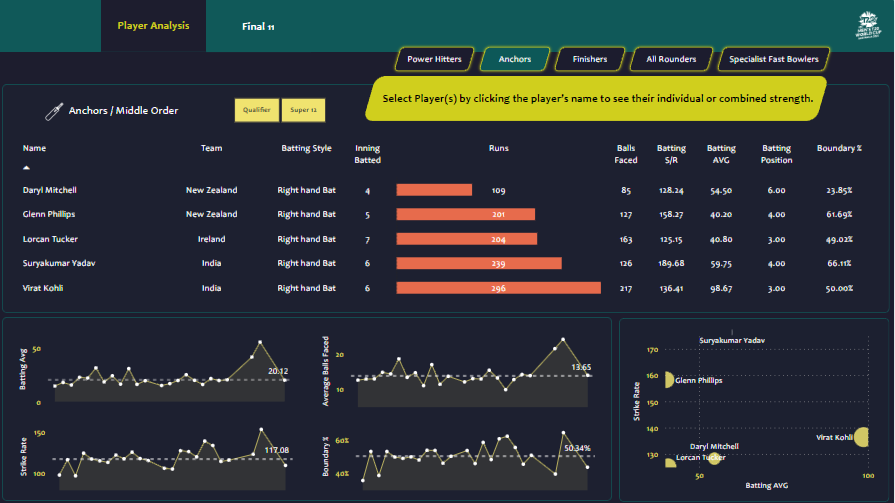
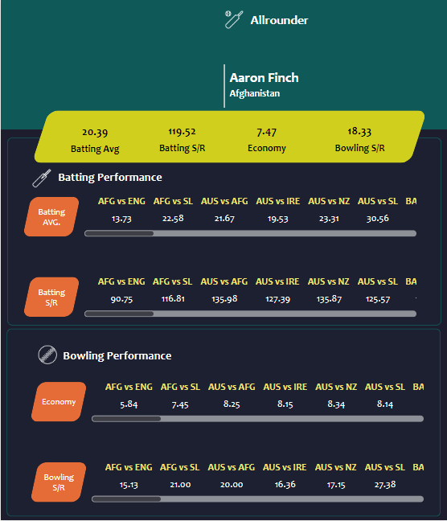

# ICC Men's T20 World Cup Analysis


## Table of Contents:
- [Introduction](#Introduction)
- [Problem Statement](#Problem-Statement)
- [Skills Demonstrated](#Skills-Demonstrated)
- [Data Sourcing](#Data-Sourcing)
- [Data Transformation](#Data-Transformation)
- [Data Modelling](#Data-Modelling)
- [Visualization](#Visualization)
- [Analysis and Conclusions](#Analysis-and-Conclusions)
- [Report](#Report)
- [References](#References)

## Introduction

The ICC Men's T20 World Cup is the Twenty20 International cricket tournament, organised by the International Cricket Council (ICC) since 2007. As of 2024, it will include 20 teams.

The event has generally been held every two years. In May 2016, the ICC put forward the idea of having a tournament in 2018, with South Africa being the possible host, but the ICC later dropped the idea of a 2018 edition after the 2017 ICC Champions Trophy. The 2020 edition of the tournament was scheduled to take place but due to the COVID-19 pandemic, the tournament was postponed until 2021, with the intended host changed to India. The 2021 ICC Men's T20 World Cup was later relocated to the United Arab Emirates (UAE) and Oman due to problems relating to the COVID-19 pandemic in India, taking place 5 years after the previous (2016) iteration.

This project is based on the 2022 T20 World Cup data, England are the reigning T20 World Cup holders, having beaten Pakistan in the 2022 final, winning their second title. 
They became the first men's team to hold both limited-overs World Cups (T20 and ODI) simultaneously.

**_Disclaimer_**: The whole project is made with the guidance of CodeBasics, Check out their playlist for this project([here](https://www.youtube.com/watch?v=4QkYy1wANXA&list=PLeo1K3hjS3utcb9nKtanhcn8jd2E0Hp9b)).

## Problem Statement
With this project, we aim to find out the best of 11 team members who have the best stats and can win against any team.
- The Team should be able to score 180 runs on average.
- They should be able to defend 150 runs on average.

## Skills Demonstrated
The following PowerBI and Python features were incorporated into this project: 
- Data Collection with web scrapping using Request, Selenium, and BeautifulSoup Python Library.
- Data Wrangling and Manipulation using Python Pandas Library.
- Data Modelling in Power BI.
- Data Analysis Expression (DAX) to create measures and calculated columns.
- Data visualization and Analysis.

## Data Sourcing
The Source of the data for this project is [ESPN Cricinfo](https://www.espncricinfo.com/records/season/team-match-results/2022to23-2022to23?trophy=89) website and it is fetched using Request, Selenium and BeautifulSoup.


All Required Libraries are imported and Functions are defined to collect the data based on the type for eg:


- Function ***match_data(match_url)*** is used to get the whole data of any match and save them separately into Batsmen and Bowler's CSVs
```
def match_data(match_url):
    match_content = get_content(match_url)
    teams = match_content.find_all('span', {"class": "ds-text-title-xs ds-font-bold ds-capitalize"})
    team1 = teams[0].text
    team2 = teams[1].text
    match_summary = match_content.find_all('tbody')[:4]
    match = f"{team1} Vs {team2}"
    innings = [team1, team2, team2, team1]
    for i in range(len(match_summary)):  
        if i % 2 == 0:
            bat_pos = 1
            for player in match_summary[i]: 
                if player.contents[0].text.strip().lower() == 'extras' or player.contents[0].text.strip().lower() == 'total':
                    break
                else:
                    try:
                        int(player.text[0])
                    except ValueError:
                        batting_dict['match'].append(match)
                        batting_dict['team_inning'].append(innings[i])
                        batting_dict['batting_pos'].append(bat_pos)
                        batting_dict['player_name'].append(player.contents[0].text.strip())
                        batting_dict['player_profile'].append(f"https://www.espncricinfo.com{player.contents[0].a['href']}")
                        player_profile_dict['profile_url'].append(f"https://www.espncricinfo.com{player.contents[0].a['href']}")
                        batting_dict['out/not_out'].append(player.contents[1].text)
                        batting_dict['run'].append(player.contents[2].text)
                        batting_dict['balls'].append(player.contents[3].text)
                        batting_dict['maiden'].append(player.contents[4].text)
                        batting_dict['4s'].append(player.contents[5].text)
                        batting_dict['6s'].append(player.contents[6].text)
                        batting_dict['strike_rate'].append(player.contents[7].text)
                        player.contents[0].text
                        bat_pos += 1
                    except IndexError:
                        continue
        else:
            for bowler in match_summary[i]:
                try:
                    int(bowler.text[0])
                except ValueError:     
                    bowling_dict['match'].append(match)
                    bowling_dict['bowling_team'].append(innings[i])
                    bowling_dict['bowler'].append(bowler.contents[0].text.strip())
                    bowling_dict['bowler_profile'].append(f"https://www.espncricinfo.com{bowler.contents[0].a['href']}")
                    player_profile_dict['profile_url'].append(f"https://www.espncricinfo.com{bowler.contents[0].a['href']}")
                    bowling_dict['over'].append(bowler.contents[1].text)
                    bowling_dict['maiden'].append(bowler.contents[2].text)
                    bowling_dict['runs'].append(bowler.contents[3].text)
                    bowling_dict['wickets'].append(bowler.contents[4].text)
                    bowling_dict['economy'].append(bowler.contents[5].text)
                    bowling_dict['0s'].append(bowler.contents[6].text)
                    bowling_dict['4s'].append(bowler.contents[7].text)
                    bowling_dict['6s'].append(bowler.contents[8].text)
                    bowling_dict['wides'].append(bowler.contents[9].text)
                    bowling_dict['no_balls'].append(bowler.contents[10].text)
```

- Function ***get_profile(driver)*** helps in getting the profile data of the player
```
def get_profile(driver):
    image_url = player_image(driver)
    team =  driver.find_element(By.XPATH, '//*[@id="main-container"]/div[5]/div[1]/div[2]/div[2]/div[2]/div/div/div[2]/div/a[1]/span/span').text
    name = driver.find_element(By.XPATH, '//*[@id="main-container"]/div[5]/div[1]/div[2]/div[1]/div[1]/div/div/div/div[1]/div/div[1]/h1').text
    skills = driver.find_elements(By.XPATH, '//*[@id="main-container"]/div[5]/div[1]/div[2]/div[2]/div[2]/div/div/div[1]')
    skill_entries = skills[0].text.split('\n')[::2]
    skill_values = skills[0].text.split('\n')[1::2]
    bating = 'nan'
    bowling = 'nan'
    role = 'nan'
    for i in range(len(skill_entries)):
        if skill_entries[i] == "BATTING STYLE":
            bating = skill_values[i] 
        elif skill_entries[i] == "BOWLING STYLE":
            bowling = skill_values[i] 
        elif skill_entries[i] == "PLAYING ROLE":
            role = skill_values[i]
    driver.quit()
    return name, team, batting, bowling, role, image_url
```

- Function ***player_image(driver)*** helps in getting the image of the player
```
def player_image(driver):
    try:
        player_image = driver.find_element(By.XPATH, '//*[@id="main-container"]/div[5]/div[1]/div[2]/div[1]/div[1]/div/div/div/div[1]/div/div[2]/div/div/img')
    except NoSuchElementException:
        return 'nan'
    else:
        return player_image.get_attribute('src')
```
- Match Summary of all the matches is created using ***get_content(base_url)***
```
matches = {"Team1":[], "Team2":[], "Winner":[], "Margin":[], "Ground":[], "Date":[],"Match_id":[], "URL":[],}
for item in all_match_content.find_all('tr'):
    matches['Team1'].append(item.contents[0].text)
    matches['Team2'].append(item.contents[1].text)
    matches['Winner'].append(item.contents[2].text)
    matches['Margin'].append(item.contents[3].text)
    matches['Ground'].append(item.contents[4].t
	ext)
    matches['Date'].append(item.contents[5].text)
    if item.contents[6].text != 'Scorecard':
        matches['Match_id'].append(item.contents[6].text)
        matches['URL'].append(f"https://www.espncricinfo.com{item.contents[6].a['href']}")
    else:
        matches['Match_id'].append('NA')
        matches['URL'].append('NA')
```
## Data Transformation
Post getting data using web scraping, it is then transformed using Pandas library, Null values are removed new columns are created and the final dataframe is then saved into CSVs.

- **All Matches DF:**


- **Batting DF:**


- **Bowling DF:**


CSV data is loaded in Microsoft Power BI for further transformation, each data file is transformed, column data types are applied column values are converted as per the requirement.


Data is loaded into Power BI and required Measures and Calculated Columns were created:

|S.No|Measure Name|Measure Category|Description/Purpose|DAX Formula|
|----|------------|----------------|-------------------|-----------|
|1|Average Balls Faced|Batting Measure|Average balls faced by the batter in an innings|Average Balls Faced = AVERAGE(batting_data[balls])|
|2|Batting Average|Batting Measure|Average runs scored in an innings|Batting Avg = DIVIDE([Total Runs], [Total Inning Dismissed], 0)|
|3|Batting Position|Batting Measure|Batting position of a player|Batting Position = ROUNDUP(AVERAGE(batting_data[batting_pos]), 0)|
|4|Boundary Percentage|Batting Measure|Percentage of boundaries scored by the Batsman|Boundary % = DIVIDE(SUM(batting_data[boundary runs]), [Total Runs], 0)|
|5|Batting Strike Rate|Batting Measure|No of runs scored per 100 balls |Strike Rate = DIVIDE([Total Runs], [Total Balls Faced], 0) * 100|
|6|Total Balls Faced|Batting Measure|Total number of balls faced by the batsman|Total Balls Faced = SUM(batting_data[balls])|
|7|Total Innings Batted|Batting Measure|Total number of innings a batsman got a chance to bat|Total Inning Batted = COUNT(batting_data[match_id])|
|8|Total Innings Dismissed|Batting Measure|To find the number of innings batsman got out|Total Inning Dismissed = SUM(batting_data[out])|
|9|Total Runs|Batting Measure|Total number of runs scored by the batsman|Total Runs = SUM(batting_data[run])|
|10|Balls Bowled|Bowling Measure|Total number of balls bowled by the bowler|Balls Bowled = SUM(bowling_data[balls])|
|11|Bowling Average|Bowling Measure|No. of runs allowed per wicket|Bowling Average = DIVIDE([Runs Conceded], [Wickets], 0)|
|12|Bowling Economy|Bowling Measure|Average number of runs conceded in an over|Bowling Economy = DIVIDE([Runs Conceded], ([Balls Bowled] / 6), 0)|
|13|Bowling Strike Rate|Bowling Measure|Number of balls bowled per wicket|Bowling Strike Rate = DIVIDE([Balls Bowled], [Wickets], 0)|
|14|Dot Ball Percentage|Bowling Measure|Percentage of dot balls bowled by a bowler|Dot Ball % = DIVIDE(SUM(bowling_data[zeros]), SUM(bowling_data[balls]), 0)|
|15|Runs Conceded|Bowling Measure|Total runs conceded by the bowler|Runs Conceded = SUM(bowling_data[runs])|
|16|Total Innings Bowled|Bowling Measure|Total number of innings bowled by a bowler|Total Inning Bowled = DISTINCTCOUNT(bowling_data[match_id])|
|17|Wickets|Bowling Measure|Total number of wickets taken by a bowler|Wickets = SUM(bowling_data[wickets])|
|18|Color Callout Value|Other Measure|To display a value only when a player is selected|Color Callout Value = if([Player Selection]="0", "#D0CF1D","#1D1D2E")|
|19|Display Text|Other Measure|To display a text of no player is selected|Display Text = if([Player Selection] = "1", " " ,"Select Player(s) by clicking the player’s name to see their individual or combined strength.")|
|20|Player Selection|Other Measure|To understand if a player is selected or not|Player Selection = if(ISFILTERED(player_profile[name]),"1","0")|


- `Calculate Columns:`

```
boundary runs = batting_data[fours] * 4 + batting_data[sixes] * 6
```

```
Boundary runs = bowling_data[fours] * 4 + bowling_data[Sixes] * 6
```

```
T1 CODE = SWITCH(match_summary[Team1],
            "Namibia", "NMB",
            "Netherlands","NT",
            "Scotland","SCT",
            "Ireland","IRE",
            "Sri Lanka","SL",
            "West Indies","WI",
            "Australia","AUS",
            "Afghanistan","AFG",
            "India","IND",
            "Bangladesh","BAN",
            "South Africa", "SAF",
            "England", "ENG",
            "Pakistan", "PAK",
            "New Zealand", "NZ",
            "Zimbabwe", "ZIM",
            "U.A.E.","UAE"
            )
```
```		
T2 CODE = SWITCH(match_summary[Team2],
            "Namibia", "NMB",
            "Netherlands","NT",
            "Scotland","SCT",
            "Ireland","IRE",
            "Sri Lanka","SL",
            "West Indies","WI",
            "Australia","AUS",
            "Afghanistan","AFG",
            "India","IND",
            "Bangladesh","BAN",
            "South Africa", "SAF",
            "England", "ENG",
            "Pakistan", "PAK",
            "New Zealand", "NZ",
            "Zimbabwe", "ZIM",
            "U.A.E.","UAE"
            )
```
```
Match = match_summary[T1 CODE] & " vs " & match_summary[T2 CODE]
```

## Data Modelling
Auto Adjusted Model has missing connections, all the connections were connected and the star schema followed the same as shown below:


## Visualization

We have 5 different kinds of players, for each kind we have made a separate page report with a table with all the required columns, 4 line charts with all different KPIs, 4 Cards each showing different stats of any selected player, and 1 scatter plot between 2 important KPIs and 3rd representing the size of the scatter bubbles, Check out all of them below:

- ***Power Hitters/ Openers:***


- ***Anchors/ Middle Order:***



- ***Finsher/ Lower Order Anchors:***


- ***All Rounder/ Lower Middle Order:***


- ***Specialist Fast Bowlers:***


Moreover, We have the Final 11 report Page which shows all the players available, you can select any player then it shows you the combined performance of the selected players using the cards:

Finally, we have player profile pages which show the player profile using a tooltip.


- **Batsmen Profile:**


- **Bowler Profile:**


- **All-Rounder Profile:**



## Analysis and Conclusions
All the visual were created post that the filters were applied which are based on the requirement we have to achieve the target, the filtered result help in reducing the size of the number of players so that we can analyze all the players and pick the best-performing player. You can check the criteria below:

- ***Power Hitters/ Openers:***


- ***Anchors/ Middle Order:***


- ***Finsher/ Lower Order Anchors:***


- ***All Rounder/ Lower Middle Order:***


- ***Specialist Fast Bowlers:***


Here, are the results of the analysis we have done:

- In Power Hitters/ Openers, we have selected Jos Buttler, Alex Hales, and Rilee Rossouw as they have good Batting Avg, Batting Strike Rate and Boundary % is also more than 60 for each. (2 of them will be in playing 11)
- In Anchors/ Middle Order, we have selected Virat Kohli and Surya Kumar Yadav as they have good Batting Avg, Boundary % and Strike Rates, also, Glen Phillips as he also has a good Boundary % and Strike Rate. (all 3 of them will be in playing 11)
- In Finsher/ Lower Order Anchors, Marcus Stoinis has a good strike rate and batting Avg, Glenn Maxwell and Sikandar Raza have good Batting and Bowling Strike Rates and Economy. (2 of them will be in playing 11)
- In Rounder/ Lower Middle Order, We have Rashid Khand and Sadab Khan as they have good Batting and Bowling Strike Rates and Bowling Economy. (2 of them will be in playing 11)
- In Specialist Fast Bowlers, We have Sam Curran, Anrich Nortje, and Shaheen Shah Afridi as they have good Bowling Strike Rates, Economy, Bowling Avg. and Dot %. (all of them will be in playing 11)


The above-mentioned players are the best playing 11 players will able to achieve our target of scoring more than 180 runs and will be able to defend a target of 150 runs. A new Calculated column to represent their batting order is added using DAX.
```
Custome Batting Order = SWITCH(TRUE(),
							player_profile[name] = ""Jos Buttler"",1,
							player_profile[name] = ""Rilee Rossouw"",2,
							player_profile[name] = ""Alex Hales"",2,
							player_profile[name]  = ""Virat Kohli"",3,
							player_profile[name] = ""Suryakumar Yadav"" ,4,
							player_profile[name] = ""Glenn Phillips"" ,5,
							player_profile[name] = ""Marcus Stoinis"" ,6,
							player_profile[name] = ""Glenn Maxwell"" ,6,
							player_profile[name] = ""Sikandar Raza"" ,7,
							player_profile[name] = ""Rashid Khan"" ,8,
							player_profile[name] = ""Shadab Khan"" ,8,
							player_profile[name] = ""Sam Curran"" ,9,
							player_profile[name] = ""Shaheen Shah Afridi"" ,10,
							player_profile[name] = ""Anrich Nortje"" ,11
							)
```

We can also check the performance of our favorite 11 players using the final 11 page, where you can select your top 11 players and check their combined performance, check out our favorite 11:


## Report
Please check out the link to the full report on [PowerBI](https://app.powerbi.com/view?r=eyJrIjoiNGM1M2RmYTktMGVlNy00ODhiLTgyOWMtY2MzZGJhNjliZDViIiwidCI6ImRmODY3OWNkLWE4MGUtNDVkOC05OWFjLWM4M2VkN2ZmOTVhMCJ9) or [NovyPro](https://www.novypro.com/project/icc-mens-t20-world-cup-analysis).

## References

- [ESPN Cricinfo](https://www.espncricinfo.com/records/season/team-match-results/2022to23-2022to23?trophy=89)
- [CodeBasics](https://www.youtube.com/@codebasics)
- [Request](https://requests.readthedocs.io/en/latest/)
- [Selenium](https://selenium-python.readthedocs.io/)
- [BeautifulSoup](https://www.crummy.com/software/BeautifulSoup/bs4/doc/)
- [Pandas](https://pandas.pydata.org/docs/#pandas-documentation)
- [Numpy](https://numpy.org/doc/)
- [Microsoft PowerBI](https://learn.microsoft.com/en-us/power-bi/)
- [Python](https://www.python.org/)
- [Anaconda Distribution](https://www.anaconda.com/)
- [Jupyter NoteBook](https://jupyter.org/)

<nav >
<a href="https://www.linkedin.com/in/rathore793/">LinkedIn</a> |
<a href="https://github.com/rathore793">Github</a> |
<a href="https://www.novypro.com/profile_projects/rahulrathore">NovyPro</a> |
</nav>


